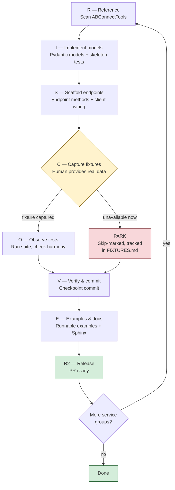

# DISCOVER Workflow v2

Phased approach for systematically implementing missing API
endpoints with real fixtures and clean context recovery.

**Constitution**: `.specify/memory/constitution.md` v2.0.0
**Principles**: II (Fixture-Driven), III (Four-Way Harmony),
V (Pending Fixture Tracking), VIII (Phase-Based Context Recovery)
**Endpoint inventory**: `specs/api-surface.md`

## Overview



## Phase Definitions

### R — Reference Scan

**Entry**: Target group selected from `specs/api-surface.md`.
**Action**: Read ABConnectTools reference material for the target group.
Do NOT copy code — study patterns, field names, edge cases.

1. **Routes**: Read `ABConnectTools/ABConnect/api/routes.py`
   (`SCHEMA["{GROUP}"]`) for the complete route list.
2. **Models**: Read `ABConnectTools/ABConnect/api/models/{service}.py`
   for field names, aliases, Optional vs required, nesting.
3. **Endpoints**: Read `ABConnectTools/ABConnect/api/endpoints/{service}.py`
   for method signatures, parameter handling, error paths.
4. **Fixtures**: Check `ABConnectTools/tests/fixtures/{Name}.json|pdf`
   for response shapes (see Ref column in `api-surface.md`).
5. **Examples**: Read `ABConnectTools/examples/api/{service}.py`
   for realistic usage patterns and parameter values.
6. Note field patterns, model names, known API quirks.

**Exit**: Understanding of legacy patterns. No code written.
**Artifact**: Optionally note deviations in the feature's `research.md`.

### I — Implement Models

**Entry**: Reference scan complete for target service group.
**Action**:
1. Create Pydantic models from swagger schemas + ABConnectTools
   model patterns observed in Phase R.
2. Write skeleton test files with `pytest.skip()` for each model
   that lacks a fixture.

**Exit**: Models pass `ruff check`. Tests skip cleanly.
**Artifact**: `ab/api/models/{service}.py`,
`tests/models/test_{service}_models.py`

**Skeleton test pattern**:

```python
import pytest
from tests.conftest import FIXTURES_DIR, load_fixture
from ab.api.models.{service} import {ModelName}

class Test{Service}Models:
    def test_{model_name}(self):
        fixture = FIXTURES_DIR / "{ModelName}.json"
        if not fixture.exists():
            pytest.skip(
                "Fixture needed: capture {ModelName}.json via "
                "GET /api/api/{endpoint_path}"
            )
        data = load_fixture("{ModelName}")
        model = {ModelName}.model_validate(data)
        assert model.id is not None
```

### S — Scaffold Endpoints

**Entry**: Models defined for target service group.
**Action**:
1. Write endpoint class methods with route definitions.
2. Register endpoint in `ab/client.py`.
3. Export from `ab/api/endpoints/__init__.py`.
4. Export models from `ab/api/models/__init__.py`.

**Exit**: Endpoint code passes `ruff check`. Client registers
all new endpoints. Imports work.
**Artifact**: `ab/api/endpoints/{service}.py`, updated
`ab/client.py`, updated `__init__.py` files.

**Checkpoint commit**: At this point, commit with message:
`feat({service}): add models and endpoint scaffold (DISCOVER R-I-S)`

### C — Capture Fixtures (Human Required)

**Entry**: Endpoints implemented for target service group.
**Action**: Human runs endpoints against staging or production
and saves responses as fixture files.

**Exit**: Fixture files exist in `tests/fixtures/`.
**Artifact**: `tests/fixtures/{ModelName}.json`

**Instructions for the human**:

```bash
# Option 1: Use the SDK directly
python -c "
from ab import ABConnectAPI
import json

api = ABConnectAPI(env='staging')
# Replace with actual endpoint call:
result = api.{service}.{method}({params})
print(json.dumps(result.model_dump(by_alias=True), indent=2))
" > tests/fixtures/{ModelName}.json

# Option 2: Use curl + jq
curl -s -H 'Authorization: Bearer TOKEN' \
  'https://portal.staging.abconnect.co/api/api/{path}' \
  | jq '.' > tests/fixtures/{ModelName}.json
```

**After capturing**: Update the test to remove `pytest.skip()`
and add `@pytest.mark.live`. Update `FIXTURES.md`.

**ABConnectTools reference**: If staging data is unavailable,
check `ABConnectTools/tests/fixtures/` for response shapes to
understand field structure. Do NOT copy fixtures — capture fresh.

### O — Observe Tests

**Entry**: Fixtures captured for target service group.
**Action**:
1. Run `pytest tests/models/test_{service}_models.py -v`.
2. Check for extra-field warnings (model drift detection).
3. Verify Four-Way Harmony checklist for each endpoint.

**Exit**: All tests pass. No unexpected skips.
**Artifact**: Passing test output.

**Four-Way Harmony checklist** (per endpoint):

- [ ] `ab/api/endpoints/{service}.py` — method exists
- [ ] `ab/api/models/{service}.py` — model exists
- [ ] `tests/fixtures/{ModelName}.json` — fixture captured
- [ ] `tests/models/test_{service}_models.py` — test passes
- [ ] `examples/{service}.py` — example exists (Phase E)
- [ ] `docs/` — documentation exists (Phase E)

### V — Verify & Commit

**Entry**: Tests pass for target service group.
**Action**:
1. Update `FIXTURES.md` — move entries from pending to captured.
2. Update `specs/api-surface.md` — mark endpoints as done.
3. Run full test suite: `pytest --tb=short`.
4. Commit checkpoint.

**Exit**: Clean git state. `FIXTURES.md` current.
**Artifact**: Git commit.

**Commit message**:
`feat({service}): capture fixtures and verify models (DISCOVER C-O-V)`

### E — Examples & Docs

**Entry**: Fixtures verified for target service group.
**Action**:
1. Write runnable example in `examples/{service}.py`.
   Reference `ABConnectTools/examples/api/{service}.py` for
   realistic usage patterns.
2. Write Sphinx documentation page.
3. Final Four-Way Harmony audit.

**Exit**: Example runs. Docs build without warnings.
**Artifact**: `examples/{service}.py`, `docs/{service}.rst`

**Commit message**:
`docs({service}): add examples and docs (DISCOVER E)`

### R2 — Release

**Entry**: All DISCOVER phases complete for the batch.
**Action**:
1. Final `pytest` run (full suite).
2. `ruff check .` passes.
3. Update `specs/api-surface.md` status columns.
4. PR ready.

**Exit**: Branch ready for PR to main.

## Batching Strategy

Work in service groups of 5–15 endpoints. Each batch completes
all DISCOVER phases before starting the next.

### Grouping Rules

1. **By API surface**: ACPortal, Catalog, ABC.
2. **By domain**: See `specs/api-surface.md` groups.
3. **By fixture availability**: Groups where ABConnectTools has
   fixtures are faster to validate — prioritize these.
4. **By priority**: Stakeholder-driven (Principle VII).

### Recommended Batch Order

See `specs/api-surface.md` § Batch Planning for current
prioritized batch list.

## Resuming Work

When entering a new context (new session, context overflow
recovery, or handoff to a different agent):

### Step 1: Read this workflow

```
Read .claude/workflows/DISCOVER.md
```

### Step 2: Check the endpoint inventory

```
Read specs/api-surface.md
```

### Step 3: Check git state

```bash
git log --oneline -20
git status
git diff --stat
```

### Step 4: Check fixture state

```bash
# Count pending vs captured
grep -c "pending" FIXTURES.md
grep -c "captured" FIXTURES.md
```

### Step 5: Run tests to see current state

```bash
pytest --tb=line -q 2>&1 | tail -20
```

### Step 6: Identify current phase

Look at the last commit message for DISCOVER phase markers
(e.g., `DISCOVER R-I-S` means phases R, I, S are done —
resume at phase C).

### Step 7: Resume

Pick up from the next incomplete phase. Do NOT restart from
scratch. All prior phase artifacts are committed and valid.

## ABConnectTools Reference Paths

Quick lookup for Phase R:

| What | Path |
|------|------|
| All routes | `/usr/src/pkgs/ABConnectTools/ABConnect/api/routes.py` |
| Models | `/usr/src/pkgs/ABConnectTools/ABConnect/api/models/{service}.py` |
| Endpoints | `/usr/src/pkgs/ABConnectTools/ABConnect/api/endpoints/{service}.py` |
| Job sub-endpoints | `/usr/src/pkgs/ABConnectTools/ABConnect/api/endpoints/jobs/{sub}.py` |
| Fixtures (JSON) | `/usr/src/pkgs/ABConnectTools/tests/fixtures/{Name}.json` |
| Fixtures (PDF) | `/usr/src/pkgs/ABConnectTools/tests/fixtures/{Name}.pdf` |
| Examples | `/usr/src/pkgs/ABConnectTools/examples/api/{service}.py` |

## Anti-Patterns

- **Fabricating fixtures**: Never invent JSON data. If you
  cannot capture a real response, write a skipping test and
  move on. The human will capture it in Phase C.
- **Copying from ABConnectTools**: Phase R is read-only.
  Understand patterns, then implement clean-room with our
  stricter standards (extra="forbid"/"allow", drift logging,
  mixin inheritance).
- **Skipping phases**: Every phase produces artifacts. Skipping
  a phase leaves gaps that compound.
- **Re-discovering endpoints**: The endpoint inventory lives in
  `specs/api-surface.md`. Never re-parse swagger to find gaps.
- **Giant batches**: Keep batches to 5–15 endpoints. Larger
  batches risk context overflow before reaching Phase V
  (checkpoint commit).
- **Uncommitted multi-phase work**: Always commit at Phase V.
  If context is lost before V, all work since the last commit
  is gone.
