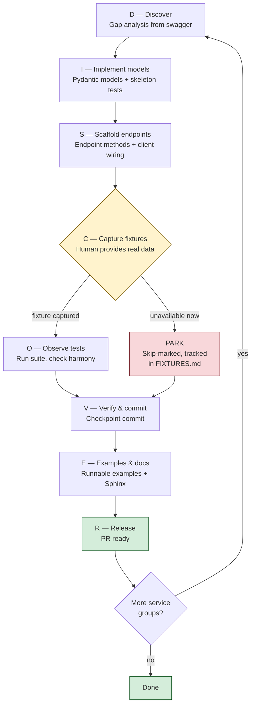

# DISCOVER Workflow

Phased approach for systematically implementing missing API
endpoints with real fixtures and clean context recovery.

**Constitution**: `.specify/memory/constitution.md` v2.0.0
**Principles**: II (Fixture-Driven), III (Four-Way Harmony),
V (Pending Fixture Tracking), VIII (Phase-Based Context Recovery)

## Overview



## Phase Definitions

### D — Discover

**Entry**: Swagger specs available at `ab/api/schemas/`.
**Action**: Compare swagger endpoints vs implemented endpoints.
Produce a gap list grouped by service domain.
**Exit**: Gap analysis committed (in spec or tracking file).
**Artifact**: `specs/{NNN}/gap-analysis.md` or equivalent.

```bash
# Quick state check
python -c "
import json
from pathlib import Path
for spec in Path('ab/api/schemas').glob('*.json'):
    data = json.loads(spec.read_text())
    paths = data.get('paths', {})
    print(f'{spec.stem}: {len(paths)} paths')
"
```

### I — Implement Models

**Entry**: Gap analysis exists for target service group.
**Action**:
1. Create Pydantic models from swagger schemas.
2. Cross-reference legacy project (`/usr/src/pkgs/ABConnectTools/`)
   for field patterns and known deviations.
3. Write skeleton test files with `pytest.skip()` for each model
   that lacks a fixture.

**Exit**: Models pass `ruff check`. Tests skip cleanly.
**Artifact**: `ab/api/models/{service}.py`,
`tests/models/test_{service}_models.py`

**Skeleton test pattern**:

```python
import pytest
from pathlib import Path
from tests.conftest import FIXTURES_DIR, load_fixture
from ab.api.models.{service} import {ModelName}

class Test{Service}Models:
    def test_{model_name}(self):
        fixture = FIXTURES_DIR / "{ModelName}.json"
        if not fixture.exists():
            pytest.skip(
                "Fixture needed: capture {ModelName}.json via "
                "GET /api/api/{endpoint_path}"
            )
        data = load_fixture("{ModelName}")
        model = {ModelName}.model_validate(data)
        assert model.id is not None
```

### S — Scaffold Endpoints

**Entry**: Models defined for target service group.
**Action**:
1. Write endpoint class methods with route definitions.
2. Register endpoint in `ab/client.py`.
3. Export from `ab/api/endpoints/__init__.py`.
4. Export models from `ab/api/models/__init__.py`.

**Exit**: Endpoint code passes `ruff check`. Client registers
all new endpoints. Imports work.
**Artifact**: `ab/api/endpoints/{service}.py`, updated
`ab/client.py`, updated `__init__.py` files.

**Checkpoint commit**: At this point, commit with message:
`feat({service}): add models and endpoint scaffold (DISCOVER D-I-S)`

### C — Capture Fixtures (Human Required)

**Entry**: Endpoints implemented for target service group.
**Action**: Human runs endpoints against staging or production
and saves responses as fixture files.

**Exit**: Fixture files exist in `tests/fixtures/`.
**Artifact**: `tests/fixtures/{ModelName}.json`

**Instructions for the human**:

```bash
# Option 1: Use the SDK directly
python -c "
from ab import ABConnectAPI
import json

api = ABConnectAPI(env='staging')
# Replace with actual endpoint call:
result = api.{service}.{method}({params})
print(json.dumps(result.model_dump(by_alias=True), indent=2))
" > tests/fixtures/{ModelName}.json

# Option 2: Use curl + jq
curl -s -H 'Authorization: Bearer TOKEN' \
  'https://portal.staging.abconnect.co/api/api/{path}' \
  | jq '.' > tests/fixtures/{ModelName}.json

# Option 3: Copy from legacy project (if validated)
cp /usr/src/pkgs/ABConnectTools/tests/fixtures/{Name}.json \
   tests/fixtures/{ModelName}.json
```

**After capturing**: Update the test to remove `pytest.skip()`
and add `@pytest.mark.live`. Update `FIXTURES.md`.

### O — Observe Tests

**Entry**: Fixtures captured for target service group.
**Action**:
1. Run `pytest tests/models/test_{service}_models.py -v`.
2. Check for extra-field warnings (model drift detection).
3. Verify Four-Way Harmony checklist for each endpoint.

**Exit**: All tests pass. No unexpected skips.
**Artifact**: Passing test output.

**Four-Way Harmony checklist** (per endpoint):

- [ ] `ab/api/endpoints/{service}.py` — method exists
- [ ] `ab/api/models/{service}.py` — model exists
- [ ] `tests/fixtures/{ModelName}.json` — fixture captured
- [ ] `tests/models/test_{service}_models.py` — test passes
- [ ] `examples/{service}.py` — example exists (Phase E)
- [ ] `docs/` — documentation exists (Phase E)

### V — Verify & Commit

**Entry**: Tests pass for target service group.
**Action**:
1. Update `FIXTURES.md` — move entries from pending to captured.
2. Run full test suite: `pytest --tb=short`.
3. Commit checkpoint.

**Exit**: Clean git state. `FIXTURES.md` current.
**Artifact**: Git commit.

**Commit message**:
`feat({service}): capture fixtures and verify models (DISCOVER C-O-V)`

### E — Examples & Docs

**Entry**: Fixtures verified for target service group.
**Action**:
1. Write runnable example in `examples/{service}.py`.
2. Write Sphinx documentation page.
3. Final Four-Way Harmony audit.

**Exit**: Example runs. Docs build without warnings.
**Artifact**: `examples/{service}.py`, `docs/{service}.rst`

**Commit message**:
`docs({service}): add examples and docs (DISCOVER E)`

### R — Release

**Entry**: All DISCOVER phases complete for the batch.
**Action**:
1. Final `pytest` run (full suite).
2. `ruff check .` passes.
3. Update `specs/{NNN}/tasks.md` checkboxes.
4. PR ready.

**Exit**: Branch ready for PR to main.

## Batching Strategy

Work in service groups of 5–15 endpoints. Each batch completes
all DISCOVER phases before starting the next.

### Grouping Rules

1. **By API surface**: ACPortal, Catalog, ABC.
2. **By domain**: jobs/*, companies/*, contacts/*, shipments/*,
   payments/*, etc.
3. **By priority**: Stakeholder-driven (Principle VII).

### Recommended Batch Order

| Batch | Domain | Est. Endpoints | API |
|-------|--------|---------------|-----|
| 1 | Jobs (timeline, tracking, notes, parcels) | ~22 | ACPortal |
| 2 | Shipments + Forms | ~29 | ACPortal |
| 3 | Payments | ~10 | ACPortal |
| 4 | Companies (extended) | ~30 | ACPortal |
| 5 | Contacts (extended) | ~25 | ACPortal |
| 6 | Settings / Admin | ~40 | ACPortal |
| 7 | Reports / Analytics | ~20 | ACPortal |
| 8 | ABC remaining | ~5 | ABC |

## Resuming Work

When entering a new context (new session, context overflow
recovery, or handoff to a different agent):

### Step 1: Read this workflow

```
Read .claude/workflows/DISCOVER.md
```

### Step 2: Check git state

```bash
git log --oneline -20
git status
git diff --stat
```

### Step 3: Check fixture state

```bash
# Count pending vs captured
grep -c "pending" FIXTURES.md
grep -c "captured" FIXTURES.md
```

### Step 4: Run tests to see current state

```bash
pytest --tb=line -q 2>&1 | tail -20
```

### Step 5: Identify current phase

Look at the last commit message for DISCOVER phase markers
(e.g., `DISCOVER D-I-S` means phases D, I, S are done —
resume at phase C).

### Step 6: Resume

Pick up from the next incomplete phase. Do NOT restart from
scratch. All prior phase artifacts are committed and valid.

## Anti-Patterns

- **Fabricating fixtures**: Never invent JSON data. If you
  cannot capture a real response, write a skipping test and
  move on. The human will capture it in Phase C.
- **Skipping phases**: Every phase produces artifacts. Skipping
  a phase leaves gaps that compound.
- **Giant batches**: Keep batches to 5–15 endpoints. Larger
  batches risk context overflow before reaching Phase V
  (checkpoint commit).
- **Uncommitted multi-phase work**: Always commit at Phase V.
  If context is lost before V, all work since the last commit
  is gone.
