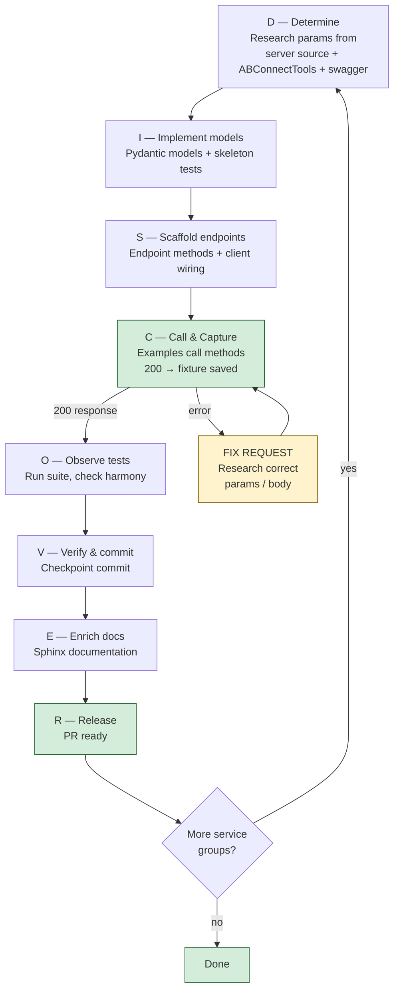

# DISCOVER Workflow v3

Phased approach for systematically implementing missing API
endpoints with example-driven fixture capture and clean context
recovery.

**Constitution**: `.specify/memory/constitution.md` v2.3.0
**Principles**: II (Example-Driven Fixture Capture),
III (Four-Way Harmony), V (Endpoint Status Tracking),
VIII (Phase-Based Context Recovery),
IX (Endpoint Input Validation)
**Endpoint inventory**: `specs/api-surface.md`

## Overview



## Phase Definitions

### D — Determine Requirements

**Entry**: Target group selected from `specs/api-surface.md`.
**Action**: Research ABConnectTools and swagger for the target
group. The goal is to know exactly what each endpoint needs
BEFORE writing an example.

For each endpoint in the group:

0. **Server source** (when accessible): Read the controller action
   at `/src/ABConnect/{project}/Controllers/{Service}Controller.cs`
   to see exact parameter binding, required fields, response
   construction, and any validation logic. Read DTOs at
   `/src/ABConnect/{project}/Models/` for exact field names and
   types. This is the ultimate source of truth (see constitution
   Sources of Truth hierarchy).
1. **Routes**: Read `ABConnectTools/ABConnect/api/routes.py`
   (`SCHEMA["{GROUP}"]`) for method + path.
2. **Endpoint code**: Read
   `ABConnectTools/ABConnect/api/endpoints/{service}.py` for
   method signatures — what parameters does it accept? What
   does it pass as query params vs request body vs URL params?
3. **Examples**: Read `ABConnectTools/examples/api/{service}.py`
   for realistic parameter values and usage patterns.
4. **Swagger**: Read the swagger spec for parameter definitions,
   required vs optional fields, and request/response body schemas.
   **Critically**: note the exact query parameter names and
   whether the endpoint has a `requestBody` — this determines
   transport type (Principle IX).
5. **Request body schema**: For POST/PUT/PATCH endpoints, extract
   the `requestBody` schema from swagger. Note required fields,
   field types, camelCase names, and nesting. These become the
   basis for `RequestModel` subclasses.
6. **Query parameter schema**: For endpoints with query params,
   extract `parameters` from swagger where `in: query`. Note
   required vs optional, types, and exact names. These become
   the basis for `params_model` definitions on Route.
7. **Models**: Read `ABConnectTools/ABConnect/api/models/{service}.py`
   for field names, aliases, Optional vs required, nesting.
   Check for both response models AND request/input models.
8. **Fixtures**: Check `ABConnectTools/tests/fixtures/{Name}.json`
   for response shapes (see Ref column in `api-surface.md`).

**Key output per endpoint**:

- HTTP method + path
- Required query parameters (with example values and types)
- Required request body fields (with example values and types)
- Required URL parameters (with example values)
- **Request model fields**: camelCase names, snake_case aliases,
  required vs optional, nesting structure
- **Params model fields** (if query params exist): parameter
  names, types, required vs optional
- Known quirks or prerequisites

**Exit**: Understanding of what every endpoint needs. No code
written yet.
**Artifact**: Optionally note deviations in the feature's
`research.md`.

### I — Implement Models

**Entry**: Determine phase complete for target service group.
**Action**:
1. Create Pydantic **response** models from swagger response
   schemas + ABConnectTools model patterns observed in Phase D.
2. Create Pydantic **request** models (`RequestModel` subclasses)
   for POST/PUT/PATCH endpoints. Fields use `snake_case` with
   `alias=camelCase` (via `AliasGenerator`). Set `extra="forbid"`
   to catch typos early. Derive fields from the swagger
   `requestBody` schema researched in Phase D.
3. Create Pydantic **params** models for endpoints with query
   parameters, following the same `RequestModel` pattern.
4. Write skeleton **response** fixture test files with
   `pytest.skip()` for each model that lacks a fixture.
5. Write skeleton **request** fixture tests in
   `tests/models/test_request_fixtures.py` — the parametrized
   test auto-discovers `tests/fixtures/requests/*.json` files.
   No manual test per model needed.

**Exit**: Models pass `ruff check`. Tests skip cleanly.
**Artifact**: `ab/api/models/{service}.py`,
`tests/models/test_{service}_models.py`

**Skeleton response test pattern**:

```python
import pytest
from tests.conftest import FIXTURES_DIR, load_fixture
from ab.api.models.{service} import {ModelName}

class Test{Service}Models:
    def test_{model_name}(self):
        fixture = FIXTURES_DIR / "{ModelName}.json"
        if not fixture.exists():
            pytest.skip(
                "Fixture needed: run examples/{service}.py — "
                "endpoint needs {what_is_missing}"
            )
        data = load_fixture("{ModelName}")
        model = {ModelName}.model_validate(data)
        assert model.id is not None
```

**Request model pattern**:

```python
from ab.api.models._base import RequestModel

class {EndpointName}Request(RequestModel):
    """Request body for POST /api/{service}/{endpoint}."""
    search_text: str | None = None
    page: int = 1
    page_size: int = 25
    # Fields use snake_case; AliasGenerator produces camelCase
```

### S — Scaffold Endpoints

**Entry**: Models defined for target service group.
**Action**:
1. Write endpoint class methods with **`**kwargs: Any`
   signatures** for body-accepting endpoints (POST/PUT/PATCH).
   Do NOT use `data: dict | Any` — callers pass snake_case
   keyword arguments directly.
2. Define Route objects with:
   - `request_model="ModelName"` for body validation
     (POST/PUT/PATCH endpoints)
   - `params_model="ModelName"` for query param validation
     (endpoints with query parameters)
   - `response_model="ModelName"` for response parsing
3. Pass `json=kwargs` to `self._request()` for body endpoints.
   Pass `params=kwargs` for query-param-only endpoints.
   `_request()` auto-validates via the model's `.check()`.
4. Register endpoint in `ab/client.py`.
5. Export from `ab/api/endpoints/__init__.py`.
6. Export models from `ab/api/models/__init__.py`.
7. Verify input validation (Principle IX): parameter names
   MUST match swagger, request bodies MUST validate against
   Pydantic `RequestModel` before sending.

**Endpoint signature pattern**:

```python
_SEARCH = Route("POST", "/companies/search/v2",
    request_model="CompanySearchRequest",
    response_model="CompanySearchResponse")

def search(self, **kwargs: Any) -> Any:
    """POST /companies/search/v2"""
    return self._request(_SEARCH, json=kwargs)
```

**Exit**: Endpoint code passes `ruff check` and
`pytest tests/test_example_params.py`. Client registers
all new endpoints. Imports work.
**Artifact**: `ab/api/endpoints/{service}.py`, updated
`ab/client.py`, updated `__init__.py` files.

**Checkpoint commit**: At this point, commit with message:
`feat({service}): add models and endpoint scaffold (DISCOVER D-I-S)`

### C — Call & Capture

**Entry**: Endpoints scaffolded for target service group.
**Action**: Write runnable examples using the request data
researched in Phase D. Run examples against staging. Capture
both **response fixtures** and **request fixtures**.

**The capture loop** (per endpoint):

1. Write example call with researched parameters using
   **snake_case kwargs** (NOT raw dicts):
   `api.{service}.{method}(search_text="test", page_size=25)`.
2. Run the example.
3. **200 response** → save response fixture to
   `tests/fixtures/{ResponseModel}.json`. Save request fixture
   to `tests/fixtures/requests/{RequestModel}.json` (camelCase
   keys, matching the serialized request body). Done.
4. **Error response** → the example has wrong or missing request
   data. Go back to Phase D research for this endpoint. Fix the
   example. Re-run. Do NOT ask for a response fixture.

**Request fixture capture**: For each endpoint with a
`request_model`, create a JSON file containing realistic
request data in camelCase (as it would be sent over the wire).
Derive values from ABConnectTools examples and swagger specs.
Add `request_fixture_file` to the `runner.add()` entry.

**Examples go in `examples/{service}.py`**. Each example file
covers all endpoints for that service group.

**Example pattern**:

```python
"""Example: {Service} operations."""

from ab import ABConnectAPI

api = ABConnectAPI(env="staging")

# {endpoint_description}
result = api.{service}.{method}(
    # kwargs researched from ABConnectTools + swagger:
    search_text="realistic_value",
    page_size=25,
)
print(f"{Method}: {result}")
```

**After capturing**: Update the test to remove `pytest.skip()`
and add `@pytest.mark.live`. Update `FIXTURES.md` status to
`captured` (or `complete` in unified 4D format).

**Exit**: Examples exist for all endpoints. Response fixtures
captured for endpoints that returned 200. Request fixtures
captured for all endpoints with request models. Remaining
endpoints tracked as `needs-request-data` in `FIXTURES.md`
with specifics.
**Artifact**: `examples/{service}.py`,
`tests/fixtures/{ResponseModel}.json` (response fixtures),
`tests/fixtures/requests/{RequestModel}.json` (request fixtures)

**Commit message**:
`feat({service}): add examples and capture fixtures (DISCOVER C)`

### O — Observe Tests

**Entry**: Examples written and fixtures captured (where possible)
for target service group.
**Action**:
1. Run `pytest tests/models/test_{service}_models.py -v`
   (response fixture validation).
2. Run `pytest tests/models/test_request_fixtures.py -v`
   (request fixture validation).
3. Check for extra-field warnings (model drift detection).
4. Verify Four-Way Harmony checklist for each endpoint.

**Exit**: All tests pass (captured) or skip with actionable
messages (needs-request-data). No unexpected failures.
Request fixtures validate against their `RequestModel` classes.
**Artifact**: Passing test output.

**Four-Way Harmony checklist** (per endpoint — all 4 dimensions):

- [ ] `ab/api/endpoints/{service}.py` — method exists with
      `**kwargs` signature (not `data: dict`)
- [ ] `ab/api/models/{service}.py` — response model exists
- [ ] `ab/api/models/{service}.py` — request model exists
      (for POST/PUT/PATCH; `—` for GET with no body)
- [ ] Route has `request_model` set (POST/PUT/PATCH) and/or
      `params_model` set (query param endpoints)
- [ ] `examples/{service}.py` — example exists with kwargs
- [ ] `tests/fixtures/{ResponseModel}.json` — response fixture
      captured (or tracked in `FIXTURES.md`)
- [ ] `tests/fixtures/requests/{RequestModel}.json` — request
      fixture captured (or `—` for GET with no body)
- [ ] `tests/models/test_{service}_models.py` — response test
      passes or skips with actionable message
- [ ] `tests/models/test_request_fixtures.py` — request fixture
      validates (auto-discovered)
- [ ] `docs/` — documentation exists (Phase E)

### V — Verify & Commit

**Entry**: Tests pass for target service group.
**Action**:
1. Update `FIXTURES.md` using the **unified 4D format**
   (one table per API surface with columns: Endpoint Path |
   Method | Req Model | Req Fixture | Resp Model | Resp
   Fixture | Status | Notes):
   - For each endpoint, fill all four dimensions:
     - **Req Model**: model class name or `—` (GET with no body)
     - **Req Fixture**: `captured` or `needs-data` or `—`
     - **Resp Model**: model class name
     - **Resp Fixture**: `captured` or `needs-data`
   - **Status**: `complete` (all applicable dimensions captured),
     `partial` (some captured), `needs-request-data` (blocked)
   - **Notes**: specifics on what's missing (never leave blank
     for non-complete endpoints)
2. Update `specs/api-surface.md` — mark endpoints as done.
3. Run full test suite: `pytest --tb=short`.
4. Commit checkpoint.

**Exit**: Clean git state. `FIXTURES.md` current with 4D status.
No generic "pending" statuses — every non-complete endpoint
specifies what request data is missing across all dimensions.
**Artifact**: Git commit.

**Commit message**:
`feat({service}): verify models and update tracking (DISCOVER O-V)`

### E — Enrich Documentation

**Entry**: Fixtures verified for target service group.
**Action**:
1. Write Sphinx documentation page.
2. Final Four-Way Harmony audit.

**Exit**: Docs build without warnings.
**Artifact**: `docs/{service}.rst`

**Commit message**:
`docs({service}): add documentation (DISCOVER E)`

### R — Release

**Entry**: All DISCOVER phases complete for the batch.
**Action**:
1. Final `pytest` run (full suite).
2. `ruff check .` passes.
3. Update `specs/api-surface.md` status columns.
4. PR ready.

**Exit**: Branch ready for PR to main.

## Batching Strategy

Work in service groups of 5–15 endpoints. Each batch completes
all DISCOVER phases before starting the next.

### Grouping Rules

1. **By API surface**: ACPortal, Catalog, ABC.
2. **By domain**: See `specs/api-surface.md` groups.
3. **By request complexity**: Groups where ABConnectTools has
   examples with realistic parameter values are faster to
   implement — prioritize these.
4. **By priority**: Stakeholder-driven (Principle VII).

### Recommended Batch Order

See `specs/api-surface.md` § Batch Planning for current
prioritized batch list.

## Resuming Work

When entering a new context (new session, context overflow
recovery, or handoff to a different agent):

### Step 1: Read this workflow

```
Read .claude/workflows/DISCOVER.md
```

### Step 2: Check the endpoint inventory

```
Read specs/api-surface.md
```

### Step 3: Check git state

```bash
git log --oneline -20
git status
git diff --stat
```

### Step 4: Check endpoint status

```bash
# Count by status
grep -c "captured" FIXTURES.md
grep -c "needs-request-data" FIXTURES.md
```

### Step 5: Run tests to see current state

```bash
pytest --tb=line -q 2>&1 | tail -20
```

### Step 6: Identify current phase

Look at the last commit message for DISCOVER phase markers
(e.g., `DISCOVER D-I-S` means phases D, I, S are done —
resume at phase C).

### Step 7: Resume

Pick up from the next incomplete phase. Do NOT restart from
scratch. All prior phase artifacts are committed and valid.

## ABConnect Server Source Paths

Quick lookup for Phase D step 0 (ultimate source of truth):

| What | Path |
|------|------|
| ACPortal controllers | `/src/ABConnect/ACPortal/ABC.ACPortal.WebAPI/Controllers/` |
| ACPortal DTOs | `/src/ABConnect/ACPortal/ABC.ACPortal.WebAPI/Models/` |
| ABC controllers | `/src/ABConnect/ABC.WebAPI/Controllers/` |
| ABC DTOs | `/src/ABConnect/ABC.WebAPI/Models/` |
| Shared entities | `/src/ABConnect/AB.ABCEntities/` |
| Business logic | `/src/ABConnect/ABC.Services/` |

## ABConnectTools Reference Paths

Quick lookup for Phase D:

| What | Path |
|------|------|
| All routes | `/usr/src/pkgs/ABConnectTools/ABConnect/api/routes.py` |
| Models | `/usr/src/pkgs/ABConnectTools/ABConnect/api/models/{service}.py` |
| Endpoints | `/usr/src/pkgs/ABConnectTools/ABConnect/api/endpoints/{service}.py` |
| Job sub-endpoints | `/usr/src/pkgs/ABConnectTools/ABConnect/api/endpoints/jobs/{sub}.py` |
| Fixtures (JSON) | `/usr/src/pkgs/ABConnectTools/tests/fixtures/{Name}.json` |
| Fixtures (PDF) | `/usr/src/pkgs/ABConnectTools/tests/fixtures/{Name}.pdf` |
| Examples | `/usr/src/pkgs/ABConnectTools/examples/api/{service}.py` |

## Anti-Patterns

- **Using `data: dict | Any` signatures**: Endpoint methods
  MUST accept `**kwargs: Any`, not `data: dict`. Callers pass
  snake_case keyword arguments directly. The `_request()`
  method validates kwargs against the `RequestModel` via
  `.check()` which calls `model_validate()` then
  `model_dump(by_alias=True)`. Using raw dicts bypasses
  validation entirely.
  See: `specs/007-request-model-methodology/contracts/endpoint-pattern.md`
- **Omitting `request_model` on POST/PUT/PATCH Routes**: Every
  Route for a body-accepting method MUST set `request_model`.
  Without it, `_request()` sends raw unvalidated kwargs as
  JSON — typos in field names are silently ignored by the API.
  Similarly, endpoints with query parameters SHOULD set
  `params_model` for validation.
- **Not tracking request fixtures in FIXTURES.md**: Every
  endpoint entry MUST fill all four dimensions (Req Model,
  Req Fixture, Resp Model, Resp Fixture). Use `—` only for
  dimensions that genuinely don't apply (e.g., GET with no
  body). Never leave request columns blank.
- **Fabricating request fixtures**: Request fixtures MUST be
  derived from swagger schemas and ABConnectTools examples,
  not invented. The fixture must validate against its
  `RequestModel` via `tests/models/test_request_fixtures.py`.
  Use realistic values from staging, not placeholder text.
- **Fabricating response fixtures**: Never invent JSON data.
  If the example errors, fix the request. Research
  ABConnectTools and swagger to find the correct params/body.
- **Asking for response fixtures when the request is wrong**:
  A 400 error means the example needs correct parameters, not
  that a human needs to provide a response. Research
  ABConnectTools and swagger to find the right request data.
- **Unvalidated inputs**: Endpoint methods MUST validate
  inputs against Pydantic models and swagger param names before
  making HTTP calls. Guessed parameter names (e.g., `street`
  instead of swagger's `Line1`) are silently ignored by the
  API. Request bodies sent as `params=` instead of `json=`
  are silently dropped. `tests/test_example_params.py` catches
  these automatically (Principle IX).
- **Writing examples without research**: Phase D exists for a
  reason. Every example MUST use parameters researched from
  ABConnectTools endpoint code, examples, and swagger specs.
- **Copying from ABConnectTools**: Phase D is read-only.
  Understand patterns, then implement clean-room with our
  stricter standards (extra="forbid"/"allow", drift logging,
  mixin inheritance).
- **Generic "pending" status**: Every non-captured endpoint
  MUST specify `needs-request-data` with details on what's
  missing. Never use a vague "pending."
- **Skipping phases**: Every phase produces artifacts. Skipping
  a phase leaves gaps that compound.
- **Re-discovering endpoints**: The endpoint inventory lives in
  `specs/api-surface.md`. Never re-parse swagger to find gaps.
- **Giant batches**: Keep batches to 5–15 endpoints. Larger
  batches risk context overflow before reaching Phase V
  (checkpoint commit).
- **Uncommitted multi-phase work**: Always commit at Phase V.
  If context is lost before V, all work since the last commit
  is gone.
